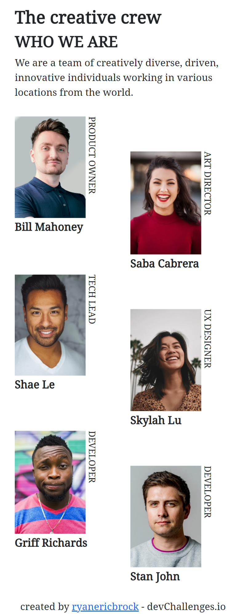

<h1 align="center">My Team Page Challenge</h1>

   Solution for a challenge from  <a href="http://devchallenges.io" target="_blank">Devchallenges.io</a>.

  <h3>
    <a href="https://ryanericbrock.github.io/My-Team-Page-Challenge/">
      Demo
    </a>
     | 
    <a href="https://github.com/ryanericbrock/My-Team-Page-Challenge/">
      Solution
    </a>
     | 
    <a href="https://devchallenges.io/challenges/hhmesazsqgKXrTkYkt0U">
      Challenge
    </a>
  </h3>

<!-- TABLE OF CONTENTS -->

## Table of Contents

- [Overview](#overview)
- [Built With](#built-with)
- [Features](#features)
- [Contact](#contact)
- [Acknowledgements](#acknowledgements)

<!-- OVERVIEW -->

## Overview

- My demo is viewable at [Demo](https://ryanericbrock.github.io/My-Team-Page-Challenge/)
- This was a nice challenge for dealing with a grid of images on a website
- The biggest challenges for me was getting the text on the right of the images to rotate
- It is useful to learn how to use the writing-mode property to rotate images

### Built With

<!-- This section should list any major frameworks that you built your project using. Here are a few examples.-->

- [Bootstrap 5](https://getbootstrap.com/docs/5.0/getting-started/introduction/)
- [Google Fonts](https://fonts.google.com/)

## Features

<!-- List the features of your application or follow the template. Don't share the figma file here :) -->

This application/site was created as a submission to a [DevChallenges](https://devchallenges.io/challenges) challenge. The [challenge](https://devchallenges.io/challenges/hhmesazsqgKXrTkYkt0U) was to build an application to complete the given user stories.

## Acknowledgements

<!-- This section should list any articles or add-ons/plugins that helps you to complete the project. This is optional but it will help you in the future. For example -->

- [Bootstrap Documentation](https://getbootstrap.com/docs/5.0/getting-started/introduction/)
- [CSS Writing-Mode Documentation](https://developer.mozilla.org/en-US/docs/Web/CSS/writing-mode)

## Contact

- Website [ryanericbrock](https://ryanericbrock.com)
- GitHub [@ryanericbrock](https://github.com/ryanericbrock)
- Twitter [@ryanericbrock](https://twitter.com/ryanericbrock)
